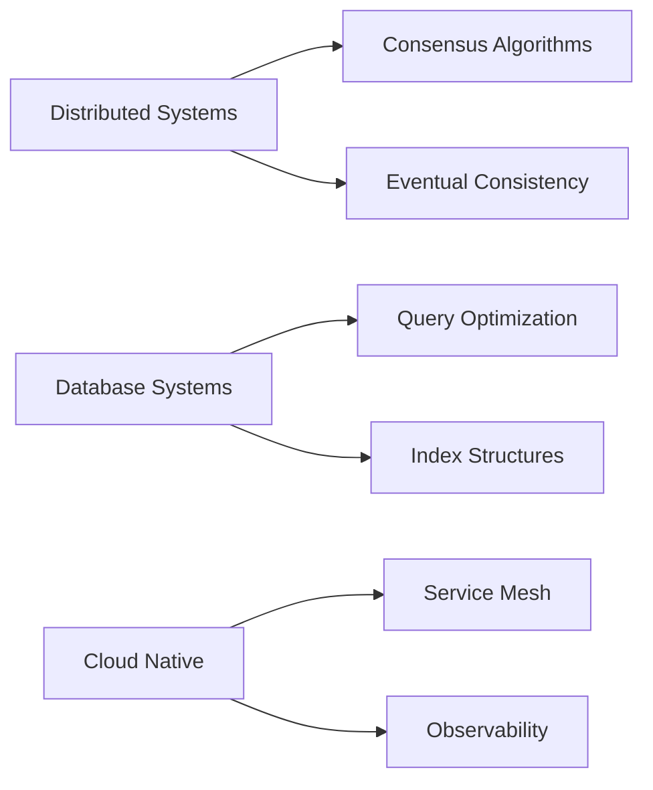

# <div align="center"></div>

---

<div align="center">

> **"Building the impossible, one query at a time."**

[](https://komarev.com/ghpvc/)
[](https://github.com/XianingY)
[](https://github.com/XianingY?tab=repositories)

</div>

---

## Who Am I?

<div align="left">

```yaml
name: Xianing Yang
location: China
role: Database & Distributed Systems Engineer
specialties:
  - Query Optimization
  - System Architecture
  - Scalable Solutions
currently_exploring:
  - Distributed Consensus Algorithms
  - Real-time Data Processing
  - Cloud-Native Architecture
```

</div>

---

## Academic Journey

<table align="center">
<tr>
<td width="60%" valign="top">

**Master's Track**
- **M.S. in Computer Science** | Wuhan University
- **Duration:** 2026 - 2028
- **Focus:** Advanced Database Systems & Distributed Computing

</td>
<td width="40%" valign="top">

**Exchange Program**
- **Short-term Program in ECE** | National University of Singapore
- **Duration:** 2025 - 2026
- **Focus:** Electrical & Computer Engineering

</td>
</tr>
<tr>
<td colspan="2" align="center">

**Bachelor's Degree**
- **B.S. in Computer Science** | Wuhan University | 2022 - 2026

</td>
</tr>
</table>

---

## Core Expertise

<details>
<summary><b>Programming Languages</b></summary>
<br>

[](https://skillicons.dev)

```
C++      ████████████ 95%
Python   ████████████ 90%
C#       ███████████ 85%
Go       ████████    80%
Java     ███████     75%
TypeScript ██████    70%
```

</details>

<details>
<summary><b>Frameworks & Technologies</b></summary>
<br>

[](https://skillicons.dev)

- **Backend:** .NET Core, Node.js, Express
- **Containers:** Docker, Kubernetes, Helm
- **ML/AI:** PyTorch, TensorFlow
- **Frontend:** React, TypeScript
- **Cloud:** AWS, Azure, GCP

</details>

<details>
<summary><b>Databases & Storage</b></summary>
<br>

[](https://skillicons.dev)

| Database | Proficiency | Use Case |
|----------|-------------|----------|
| **MySQL** | 90% | OLTP, Transactional Systems |
| **PostgreSQL** | 85% | Advanced Analytics |
| **MongoDB** | 80% | Document Storage |
| **Redis** | 88% | Caching & Sessions |
| **Elasticsearch** | 75% | Search & Analytics |
| **InfluxDB** | 70% | Time-Series Data |

</details>

---

## Current Research & Focus

### Active Projects

> **Database Query Optimizer** - Intelligent query planning using machine learning
>
> **Distributed Transaction Coordinator** - Implementing two-phase commit protocol
>
> **Real-time Analytics Pipeline** - Stream processing with Apache Kafka

---

## Contribution Graph

<div align="center">


</div>

---

## GitHub Statistics

<div align="center">

<table>
<tr>
<td align="center" width="50%">


</td>
<td align="center" width="50%">


</td>
</tr>
</table>

</div>

<div align="center">


</div>

---

## Featured Repositories

<div align="center">

[](https://github.com/XianingY/XianingY)
[](https://github.com/XianingY/XianingY)
[](https://github.com/XianingY/XianingY)

</div>

---

## What I'm Learning

<div align="center">



</div>

---

## Let's Connect

<div align="center">

[](https://linkedin.com/in/yourusername)
[](https://twitter.com/yourusername)
[](mailto:your.email@example.com)
[](https://github.com/XianingY)

</div>

---

<div align="center">

**[Back to Top](#-hi-im-xianing-yang)**

</div>

---

<div align="center">


</div>